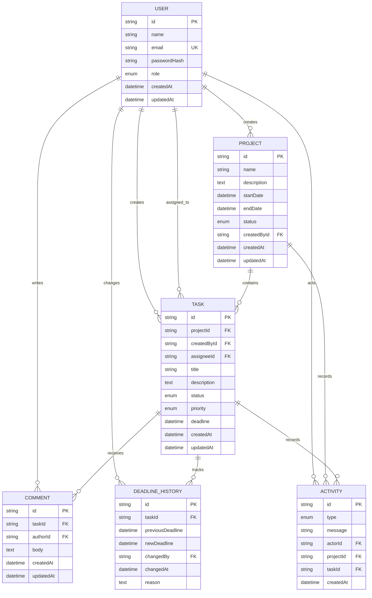

# Entity Relationship Diagram

The following Mermaid diagram reflects the authoritative Prisma schema in `prisma/schema.prisma`.

`DeadlineHistory` is append-only at the service boundary. A deadline update uses one Prisma transaction to update the task, insert the matching history row, and create the related activity event. Nullable dates represent an initially unset deadline or a deadline removed by an authorized update.
